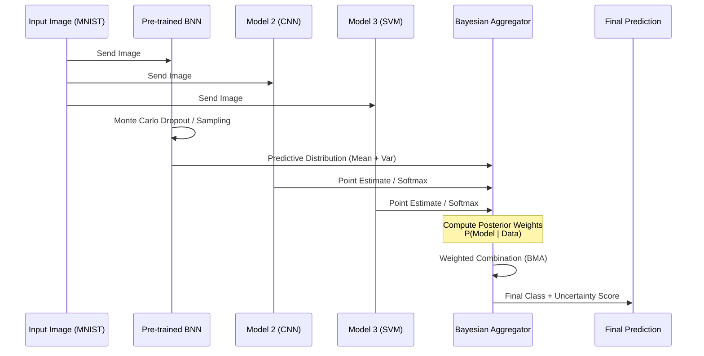

## Technology Stack

- **Python (66%)**: Jupyter Notebooks, TensorFlow, Keras
  - Deep learning model development
  - Bayesian Neural Networks
  - Data analysis and visualization
  
- **Rust (34%)**: High-performance inference
  - Model ensemble implementation
  - Efficient inference pipelines

## Key Dependencies

### Core ML Libraries
- **TensorFlow 2.20.0**: Deep learning framework
- **Keras 3.13.2**: High-level neural networks API
- **TensorFlow Probability 0.25.0**: Probabilistic modeling

### Supporting Libraries
- **NumPy 2.4.1**: Numerical computing
- **Pandas 3.0.0**: Data manipulation
- **Scikit-learn 1.8.0**: Machine learning utilities
- **Matplotlib 3.10.8**: Data visualization
- **Jupyter Lab 4.5.3**: Interactive notebooks

## Getting Started

### Prerequisites
- Python 3.13+ *newer versions have breaking changes to tensorflow, so keep that in mind
- Rust (for rust_ensemble features)

### Installation

1. Clone the repository:
```bash
git clone https://github.com/ngangakevin/learn-tensorflow.git
cd learn-tensorflow
```
2. Install Python dependencies:
```bash
pip install -r requirements.txt
```
3. (Optional) Build Rust components:
```bash
cd rust_ensemble
cargo build --release
```

 ### Running the Project
 1. Launch Jupyter Lab:
 ```bash
jupyter lab
```
2. Open bnn.ipynb to explore the Bayesian Neural Network implementation.
3. Load trained models:
```bash
import keras
model = keras.models.load_model('final_model.keras')
```
## Project Components

### Bayesian Neural Networks (bnn.ipynb)

- Implementation of probabilistic neural networks
- Uncertainty quantification in predictions
- Training and evaluation notebooks
- Model visualization and analysis
- Trained Models

**final_model.keras**: Keras format model for easy loading in TensorFlow
**model.safetensors**: SafeTensors format for interoperability

### Rust Ensemble Module

High-performance inference and model ensembling using Rust for better performance and memory efficiency.

## Usage Examples

Loading and using the trained model:
```python
import tensorflow as tf
import keras

# Load the model
model = keras.models.load_model('final_model.keras')

# Make predictions
predictions = model.predict(your_data)
```
## Architecture: Bayesian Model Aggregation

The project implements a sophisticated ensemble approach that combines multiple models through Bayesian Model Averaging (BMA):
```Mermaid
sequenceDiagram
    participant U as Input Image (MNIST)
    participant BNN as Pre-trained BNN
    participant M2 as Model 2 (CNN)
    participant M3 as Model 3 (SVM)
    participant BL as Bayesian Aggregator
    participant O as Final Prediction

    U->>BNN: Send Image
    U->>M2: Send Image
    U->>M3: Send Image
    
    BNN->>BNN: Monte Carlo Dropout / Sampling
    BNN->>BL: Predictive Distribution (Mean + Var)
    
    M2->>BL: Point Estimate / Softmax
    M3->>BL: Point Estimate / Softmax
    
    Note over BL: Compute Posterior Weights<br/>P(Model | Data)
    
    BL->>BL: Weighted Combination (BMA)
    BL->>O: Final Class + Uncertainty Score
```
### How It Works

The model is trained using a dataset of images with corresponding labels. The training process involves several steps:
- **Data Preprocessing**: This step includes resizing images, normalizing pixel values, and augmenting the dataset to increase its variability.

- **Model Architecture Setup**: The architecture includes convolutional layers to extract features, followed by pooling layers to reduce dimensionality.

- **Training**: The model is trained using a loss function and an optimizer. The process is repeated for several epochs until the model's performance becomes satisfactory.

- **Evaluation**: Once trained, the model is evaluated on a test dataset to check its accuracy and performance metrics.


### Development Workflow

This project uses Jupyter Notebooks for interactive development and experimentation. The bnn.ipynb notebook contains the main implementation details and can be used to:

- Train models
- Evaluate performance
- Visualize results
- Experiment with different architectures

### Contributing

Contributions are welcome! Please feel free to submit issues or pull requests.
#### Contribution Areas

Contributors can work on different modules of our ensemble architecture:

### How to Contribute

1. Bayesian Neural Network Module (Python)

Enhance the BNN architecture in bnn.ipynb
Implement advanced uncertainty quantification techniques
Optimize Monte Carlo Dropout sampling
Add regularization improvements
2. Additional Model Integration (Python)

Implement Model 2 (e.g., CNN improvements)
Develop Model 3 (e.g., alternative classifiers)
Add support for new model architectures
Optimize model training pipelines
3. Bayesian Aggregation Module (Python/Rust)

Improve posterior weight computation
Implement advanced Bayesian Model Averaging techniques
Optimize the weighted combination algorithm
Add uncertainty calibration methods
4. Rust Ensemble Module (Rust)

Optimize inference performance in rust_ensemble/
Implement efficient model serialization
Add GPU support for faster predictions
Improve memory management
Getting Started with Contributions

#### Fork the repository
Create a feature branch: 
```git
git checkout -b feature/your-module-enhancement
```
Make your changes and test thoroughly
Document your changes with comments and update relevant sections
Commit with clear messages: 
```git
git commit -m "Add [module] improvement: description"
```
Push to your fork: 
```git
git push origin feature/your-module-enhancement
```
Open a Pull Request with a detailed description of your changes

### Guidelines

Follow PEP 8 for Python code
Add docstrings to new functions and classes
Include unit tests for new features
Update documentation and comments
Test with MNIST dataset before submitting

### License

Please check the repository for license information.

### Author

Kevin Nganga (@ngangakevin)

Last Updated: February 2026
